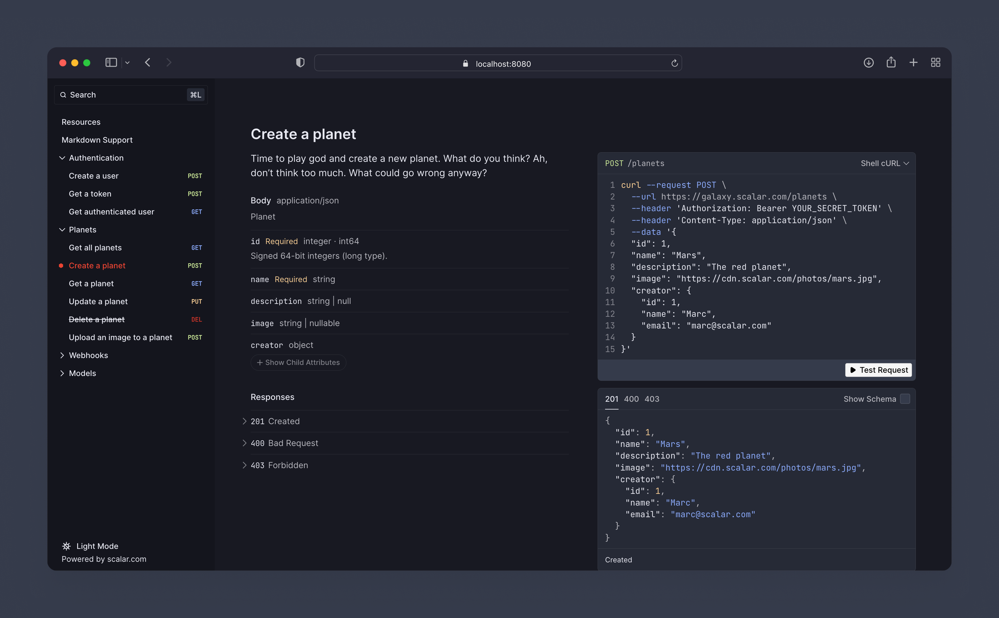

# Scalar for Laravel

[](https://packagist.org/packages/scalar/laravel)
[](https://github.com/scalar/laravel/actions?query=workflow%3Arun-tests+branch%3Amain)
[](https://github.com/scalar/laravel/actions?query=workflow%3A"Fix+PHP+code+style+issues"+branch%3Amain)
[](https://packagist.org/packages/scalar/laravel)

Use your OpenAPI documents to render modern API references in Laravel



## Installation

Install the package via Composer:

```bash
composer require scalar/laravel
```

Then run the install command to publish the config file and finish setup:

```bash
php artisan scalar:install
```

That’s everything you need to get started. Prefer to publish things manually? You can:

```bash
# Publish the config file to config/scalar.php
php artisan vendor:publish --tag="scalar-config"

# Publish the Blade views (only needed if you want to customize them)
php artisan vendor:publish --tag="scalar-views"
```

## Usage

You’ll need an OpenAPI (formerly Swagger) document to render your API reference. Several packages can generate one from your Laravel app:

* [dedoc/scramble](https://github.com/dedoc/scramble)
* [knuckleswtf/scribe](https://github.com/knuckleswtf/scribe)
* [vyuldashev/laravel-openapi](https://github.com/vyuldashev/laravel-openapi)

Point Scalar at your document in `config/scalar.php`. You can provide it in three ways:

**A URL** fetched by the browser — a path served by your own app, or an absolute URL:

```php
'url' => '/openapi.yaml',
// 'url' => 'https://example.com/openapi.json',
```

A relative URL just needs to be reachable on the same origin. An absolute, cross-origin URL needs to be publicly accessible (and may go through the built-in `proxyUrl`).

**A local file** read on the server and embedded in the page — it never needs to be publicly accessible:

```php
'file' => storage_path('app/openapi.json'),
```

**Inline content** — the raw OpenAPI document as a JSON or YAML string:

```php
'content' => '{ "openapi": "3.1.0", "info": { "title": "My API", "version": "1.0.0" } }',
```

When more than one is set, `file` takes precedence over `content`, which takes precedence over `url`. Then visit `/scalar` to see your API reference.

## Theme

The reference ships with a Laravel-flavored theme, enabled by default (`'theme' => 'laravel'` in the config). Scalar also comes with a range of built-in themes — see the `configuration.theme` option in `config/scalar.php` for the full list.

## Multiple documents

Render more than one OpenAPI document behind a document switcher — useful for versioned APIs (`v1`, `v2`) or public vs. internal references. Define them in the `sources` config:

```php
// config/scalar.php

'sources' => [
    ['title' => 'API v1', 'slug' => 'v1', 'url' => '/openapi/v1.yaml'],
    ['title' => 'API v2', 'slug' => 'v2', 'url' => '/openapi/v2.yaml', 'default' => true],
],
```

Each source accepts a `title`, an optional `slug`, one of `url`/`content`/`file`, and an optional `default` flag.

You can also register documents at runtime with the `Scalar` facade — for example in a service provider — which is handy when the list is dynamic:

```php
use Scalar\Facades\Scalar;

Scalar::document('API v1')->url('/openapi/v1.yaml');
Scalar::document('API v2')->file(storage_path('app/openapi/v2.json'))->default();
```

Registered documents take precedence over the `sources` config.

## Authorization

The Scalar API reference may be accessed via the /scalar route. By default, everyone will be able to access this route. However, within your App\Providers\AppServiceProvider.php file, you can overwrite the gate definition. This authorization gate controls access to Scalar in non-local environments. You are free to modify this gate as needed to restrict access to your documentation:

```php
<?php

namespace App\Providers;

use App\Models\User;
use Illuminate\Support\Facades\Gate;
use Illuminate\Support\ServiceProvider;

class AppServiceProvider extends ServiceProvider
{
    public function boot(): void
    {
        Gate::define('viewScalar', function (?User $user) {
            return in_array($user?->email, [
                //
            ]);
        });
    }
}
```

## Testing

```bash
composer test
```

## Changelog

Please see [CHANGELOG](CHANGELOG.md) for more information on what has changed recently.

## Contributing

Contributions are welcome.

## Credits

- [Hans Pagel](https://github.com/hanspagel)
- [All Contributors](../../contributors)

## License

The MIT License (MIT). Please see [License File](LICENSE.md) for more information.
